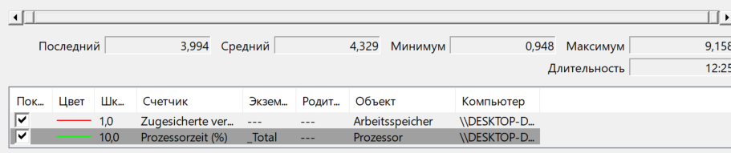
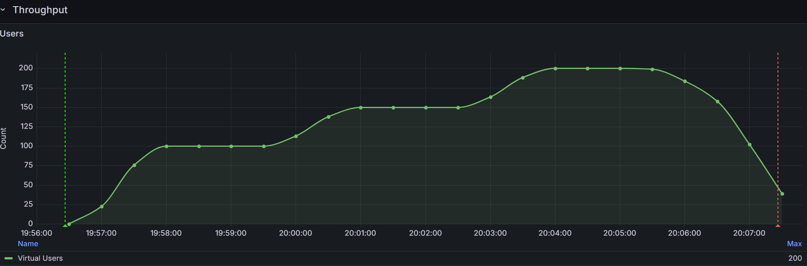
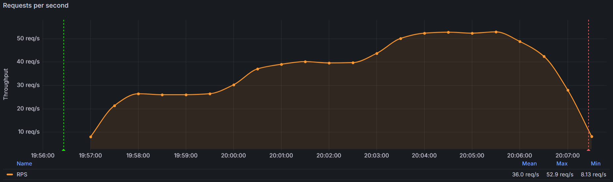
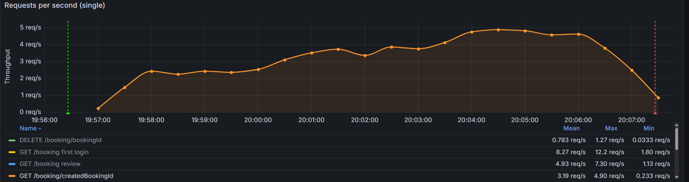
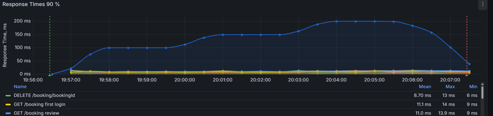
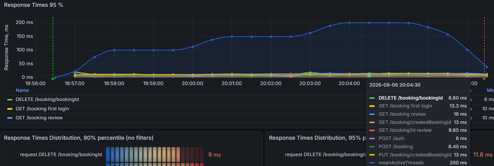
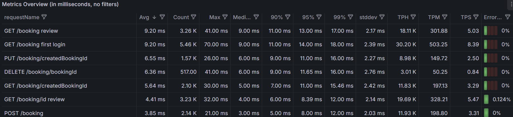
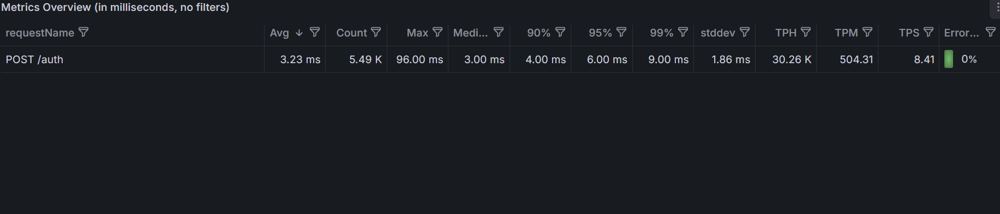
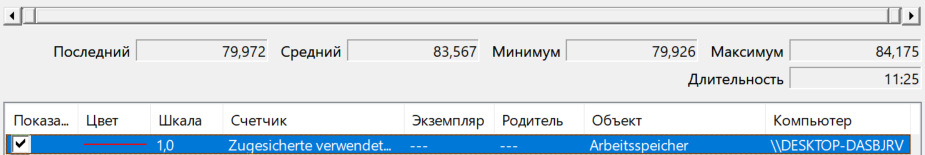
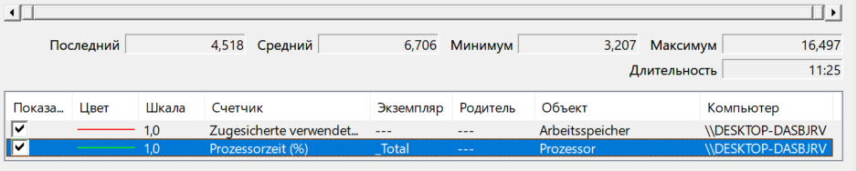

# API Performance Testing — Restful Booker

> Performance testing portfolio project using **Apache JMeter, InfluxDB, Grafana and Windows Performance Monitor**.

---

## 🎯 Objectives

- Evaluate API stability under sustained concurrent load
- Measure response time and throughput
- Analyze **P90 / P95 / P99** latency
- Monitor error rate
- Validate API behavior under increasing concurrency
- Identify concurrency and data-consistency issues
- Correlate API performance with system resource utilization

---

## 🛠 Tech Stack

| Tool | Purpose |
|---|---|
| **Apache JMeter 5.6.3** | Load and stress testing |
| **Restful Booker REST API** | System under test |
| **Groovy / JSR223** | Dynamic correlation and scripting |
| **JSON Extractor** | Extract booking IDs from API responses |
| **Throughput Controller** | Model business traffic distribution |
| **InfluxDB** | Time-series performance metrics |
| **Grafana** | Real-time performance dashboards |
| **Windows Performance Monitor** | CPU and memory monitoring |
| **GitHub** | Portfolio and test artifacts |

---

## 🧪 Test Scenario

The test plan models two main user journeys: **Review** and **Manage Booking**.

```text
Thread Group
│
├── Authentication
│
├── Review — 60%
│   ├── GET /booking
│   │   └── JSON Extractor → bookingId
│   └── GET /booking/{bookingId}
│
└── Manage Booking — 40%
    ├── POST /booking
    │   └── JSON Extractor → createdBookingId
    │
    └── Booking operation
        ├── PUT /booking/{createdBookingId} — 75%
        └── DELETE /booking/{createdBookingId} — 25%
```

### Approximate operation distribution

| Operation | Share |
|---|---:|
| GET /booking | **60%** |
| POST /booking | **40%** |
| PUT /booking/{id} | **30%** |
| DELETE /booking/{id} | **10%** |

The authentication flow uses the Restful Booker token as a `token` cookie. Dynamic booking IDs are correlated between requests using **JSON Extractor** and **JSR223/Groovy**.

---

# 📊 Load Test

### Test profile

**50 concurrent users · 10 minutes · Non-GUI execution**

| Metric | Result |
|---|---:|
| Concurrent users | **50** |
| Duration | **10 min** |
| Total requests | **9,262** |
| Throughput | **~15.4 req/s** |
| Average response time | **3 ms** |
| Minimum response time | **0 ms** |
| Maximum response time | **37 ms** |
| Error rate | **0.00%** |

### Concurrent Users


### Overall Throughput


The Grafana dashboard showed steady-state throughput of approximately **12.5–13.3 req/s** for the selected dashboard interval.

> The **~15.4 req/s** value above is the overall JMeter result for the run; the Grafana panel shows a selected steady-state interval, so the two figures are not expected to be identical.

### Throughput by Endpoint


---

# ⏱ Load Test Response Time

## P90


| Endpoint | P90 |
|---|---:|
| GET /booking review | **6 ms** |
| GET /booking | **6 ms** |
| DELETE /booking/bookingId | **6 ms** |
| PUT /booking/createdBookingId | **5 ms** |
| GET /booking/createdBookingId | **5 ms** |
| POST /booking | **5 ms** |
| POST /auth | **3 ms** |

## P95


| Endpoint | P95 |
|---|---:|
| GET /booking review | **7 ms** |
| GET /booking | **7 ms** |
| DELETE /booking/bookingId | **6 ms** |
| PUT /booking/createdBookingId | **6 ms** |
| GET /booking/createdBookingId | **6 ms** |
| POST /booking | **5 ms** |
| POST /auth | **4 ms** |

## P99


| Endpoint | P99 |
|---|---:|
| GET /booking review | **21.41 ms** |
| GET /booking | **9.00 ms** |
| DELETE /booking/bookingId | **16.03 ms** |
| PUT /booking/createdBookingId | **8.15 ms** |
| GET /booking/createdBookingId | **7.00 ms** |
| POST /booking | **7.00 ms** |
| POST /auth | **4.00 ms** |

### Windows Performance Monitor — CPU & Memory




| Resource | Minimum | Average | Maximum |
|---|---:|---:|---:|
| CPU | **0.948%** | **4.329%** | **9.158%** |
| Memory (Committed) | **76.788%** | **77.372%** | **77.798%** |

The Windows Performance Monitor collector used a **5-second sampling interval** during the Load Test resource-monitoring run.

### Load Test conclusion

The API remained stable at **50 concurrent users** with **0.00% errors**. Response times stayed low, with **P95 at 7 ms or below** across the measured endpoints and the highest observed P99 at **21.41 ms** for `GET /booking review`.

---

# 🔥 Stress Test

A separate step-load test was executed with increasing concurrency:

```text
100 users
   ↓
150 users
   ↓
200 users
   ↓
graceful shutdown
```

The test reached a maximum of **200 concurrent virtual users**.

### Stress Test — JMeter / Grafana summary

| Metric | Result |
|---|---:|
| Maximum virtual users | **200** |
| Test duration | **~11 min 25 sec** |
| Total requests | **23,756** |
| Average throughput | **36.0 req/s** |
| Peak throughput | **52.9 req/s** |
| Minimum throughput | **8.13 req/s** |
| Average response time | **~6.14 ms** |
| Minimum response time | **1 ms** |
| Maximum response time | **96 ms** |
| Errors | **4** |
| Error rate | **~0.017%** |

> The request count, response-time summary and error count above are based on the JTL data for the final Stress Test time window. Grafana reports an average throughput of **36.0 req/s**.

### Concurrent Users



The load profile clearly shows the step pattern:

```text
100 → 150 → 200 users
```

followed by a controlled ramp-down.

### Overall Throughput



The observed throughput increased with concurrency:

| Load level | Approx. throughput |
|---|---:|
| ~100 users | **~26 req/s** |
| ~150 users | **~39–40 req/s** |
| ~200 users | **~50–53 req/s** |

The Grafana dashboard reports a peak of **52.9 req/s** and an average of **36.0 req/s** for the selected test interval.

### Throughput by Endpoint



---

# ⏱ Stress Test Response Time

## P90



At peak concurrency, `GET /booking review` became the main latency outlier in the Grafana time series, reaching approximately **200 ms P90**. The remaining endpoints stayed in the low-millisecond range.

## P95



The P95 graph shows the same pattern: `GET /booking review` is the main latency outlier under peak concurrency, while the other endpoints remain comparatively low.

## Endpoint Metrics Overview





| Endpoint | Avg | P90 | P95 | P99 | Max | Error rate |
|---|---:|---:|---:|---:|---:|---:|
| GET /booking review | **9.20 ms** | **11 ms** | **13 ms** | **17 ms** | **41 ms** | **0%** |
| GET /booking first login | **9.20 ms** | **11 ms** | **14 ms** | **18 ms** | **70 ms** | **0%** |
| PUT /booking/createdBookingId | **6.55 ms** | **9 ms** | **11 ms** | **16 ms** | **26 ms** | **0%** |
| DELETE /booking/bookingId | **6.36 ms** | **9 ms** | **11.65 ms** | **16 ms** | **41 ms** | **0%** |
| GET /booking/createdBookingId | **5.64 ms** | **7 ms** | **11 ms** | **15.46 ms** | **30 ms** | **0%** |
| GET /booking/id review | **4.41 ms** | **6 ms** | **8.39 ms** | **12 ms** | **32 ms** | **0.124%** |
| POST /booking | **3.85 ms** | **5 ms** | **8 ms** | **12 ms** | **21 ms** | **0%** |
| POST /auth | **3.23 ms** | **4 ms** | **6 ms** | **9 ms** | **96 ms** | **0%** |

### Stress Test latency observations

- `GET /booking review` is the main latency outlier in the Grafana P90/P95 time series during peak concurrency.
- The endpoint-level metrics table still shows relatively low aggregate percentiles for the same request, indicating that the higher latency is concentrated around the peak-load interval.
- `POST /auth` had the highest single maximum response time at **96 ms**, while its P99 remained only **9 ms**.
- Only `GET /booking/id review` reported an endpoint-level error rate in the Grafana metrics table: **0.124%**.

---

# 🖥️ System Resource Monitoring

CPU and memory were monitored during the final Stress Test using the built-in **Windows Performance Monitor** with a **5-second sampling interval**.

### CPU


| CPU metric | Result |
|---|---:|
| Minimum | **3.207%** |
| Average | **6.706%** |
| Maximum | **16.497%** |

### Memory


| Memory metric | Result |
|---|---:|
| Minimum | **79.926%** |
| Average | **83.567%** |
| Maximum | **84.175%** |

### Resource Statistics





### Interpretation

- CPU utilization remained low even at **200 concurrent users**.
- The CPU maximum was approximately **16.5%**, so the test machine was **not CPU-bound**.
- Memory utilization remained relatively stable around **80–84%**.
- No clear CPU saturation was observed during the stress run.
- Memory was the more heavily utilized resource and should be monitored if the test intensity is increased further.

> **Memory metric note:** the Windows counter used here represents **% Committed Bytes In Use / % использования выделенной памяти**. It is not a direct measurement of physical RAM utilization.

---

# ⚠️ Data Consistency / Race Condition

The booking dataset is dynamic. Under concurrent execution, the following situation is possible:

```text
User A: GET /booking
        ↓
        receives booking ID 123

User B: DELETE /booking/123
        ↓
        booking is removed

User A: GET /booking/123
        ↓
        404 Not Found
```

This is a **concurrency / data-consistency issue** caused by multiple virtual users operating on the same dynamic dataset.

During the final Stress Test, the Grafana endpoint metrics showed:

```text
GET /booking/id review → 0.124% errors
```

The JTL window contained **4 HTTP 404 responses** overall, which corresponds to approximately **0.017% of all requests**.

These responses were not blindly hidden by marking every `404` as successful. The behavior is documented as an expected race-condition scenario in the current dynamic test data model.

---

# 📈 Monitoring Architecture

```text
                     ┌─────────────────┐
                     │   Apache JMeter │
                     └────────┬────────┘
                              │
                              ▼
                     ┌─────────────────┐
                     │     InfluxDB    │
                     └────────┬────────┘
                              │
                              ▼
                     ┌─────────────────┐
                     │     Grafana     │
                     └─────────────────┘

              Windows Performance Monitor
                       │          │
                       ▼          ▼
                     CPU       Memory
```

### Monitored metrics

- Virtual users / active threads
- Overall throughput / RPS
- Endpoint throughput
- Average response time
- P90
- P95
- P99
- Maximum response time
- Error rate
- Endpoint-level performance
- CPU utilization
- Memory utilization

---

# ▶️ Run the Test

Run JMeter in **Non-GUI mode**:

```bat
cd C:\Projects\apache-jmeter-5.6.3\bin

jmeter.bat -n -t "C:\Projects\apache-jmeter-5.6.3\Projects\api_load_test\testplan\api_load_test.jmx" -l "C:\Projects\apache-jmeter-5.6.3\Projects\api_load_test\testplan\results.jtl"
```

For a dedicated Stress Test result file:

```bat
jmeter.bat -n -t "C:\Projects\apache-jmeter-5.6.3\Projects\api_load_test\testplan\api_load_test.jmx" -l "C:\Projects\apache-jmeter-5.6.3\Projects\api_load_test\testplan\stress_final.jtl"
```

### Recommended execution order

1. Start the local Restful Booker application.
2. Start the InfluxDB/Grafana monitoring stack.
3. Start Windows Performance Monitor Data Collector Set for CPU and memory.
4. Run JMeter in Non-GUI mode.
5. Stop the Data Collector Set after the test.
6. Analyze JMeter/JTL results and Grafana dashboards.
7. Compare throughput, latency, errors and system resources.

---

# 📁 Repository Structure

```text
api-performance-testing/
├── README.md
├── jmeter/
│   └── api_load_test.jmx
├── results/
│   ├── load-test/
│   └── stress-test/
└── screenshots/
    ├── 01-concurrent-users.png
    ├── 02-throughput.png
    ├── 03-throughput-by-endpoint.png
    ├── 04-response-time-p90.png
    ├── 05-response-time-p95.png
    ├── 06-metrics-overview.png
    ├── 07-stress-users.png
    ├── 08-stress-throughput.png
    ├── 09-stress-throughput-by-endpoint.png
    ├── 10-stress-p90.png
    ├── 11-stress-p95.png
    ├── 12-stress-memory-graph.png
    ├── 13-stress-cpu-graph.png
    ├── 14-stress-memory-stats.png
    ├── 15-stress-cpu-stats.png
    ├── 16-stress-metrics-overview-1.png
    └── 17-stress-metrics-overview-2.png
```

---

# 🏆 Key Results

## Load Test

**50 concurrent users · 10 min · 9,262 requests · ~15.4 req/s · 3 ms average · 0.00% errors**

## Load Test Latency

**P90 ≤ 7 ms · P95 ≤ 7 ms · highest P99 = 21.41 ms**

## Stress Test

**Up to 200 concurrent users · 23,756 requests · 36.0 req/s average · 52.9 req/s peak · ~6.14 ms average response time · 4 errors / ~0.017%**

## Stress Test Resources

**CPU: 6.706% average · 16.497% max**

**Memory: 83.567% average · 84.175% max**

## Main Finding

The API handled the increase from **50 users in the Load Test to 200 users in the Stress Test** without CPU saturation. Throughput increased with concurrency and reached approximately **52.9 req/s** at peak.

The main observed issue was not infrastructure saturation but a small number of **404 responses caused by concurrent access to a dynamic booking dataset**, documented as a race-condition/data-consistency behavior.

---

# 👨‍💻 Skills Demonstrated

**Performance Test Planning · Load Testing · Stress Testing · Apache JMeter · REST API Testing · Non-GUI Execution · Dynamic Correlation · JSON Extractor · JSR223/Groovy · Throughput Controller · Cookie-Based Authentication · InfluxDB · Grafana · Windows Performance Monitor · P90/P95/P99 Analysis · Throughput Analysis · Error Analysis · Concurrency/Race-Condition Analysis · System Resource Monitoring · Performance Reporting**
