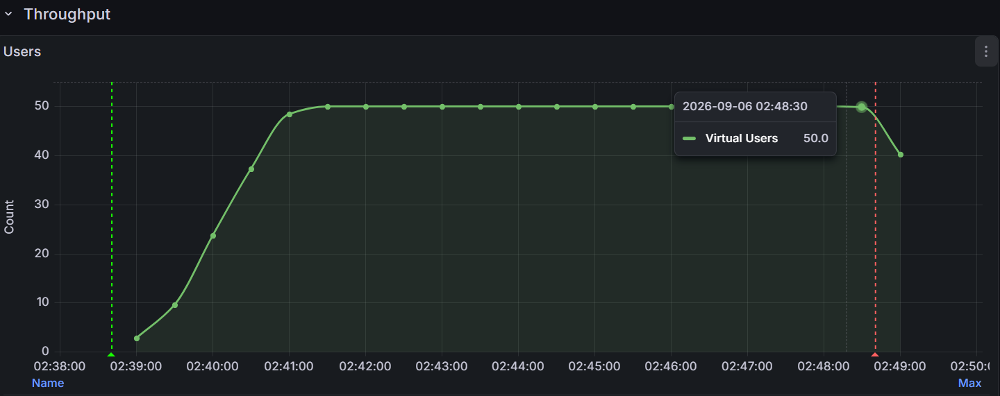
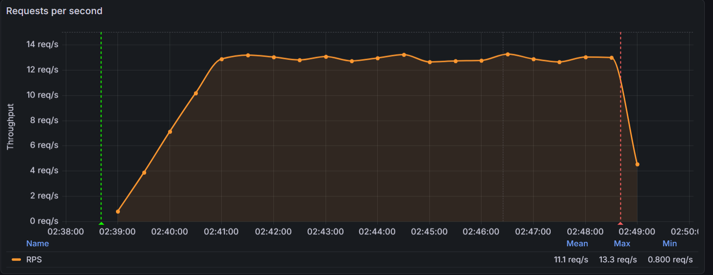
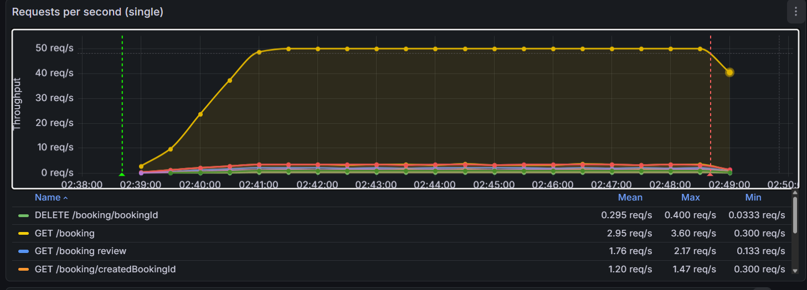
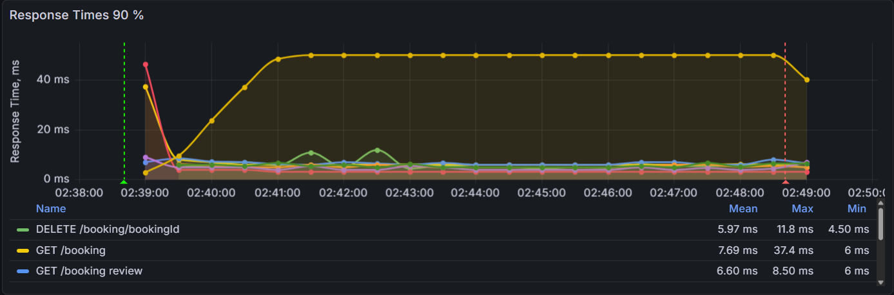
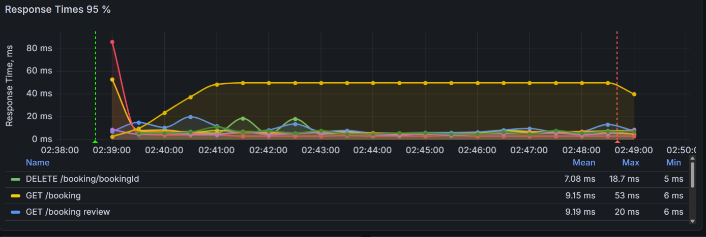
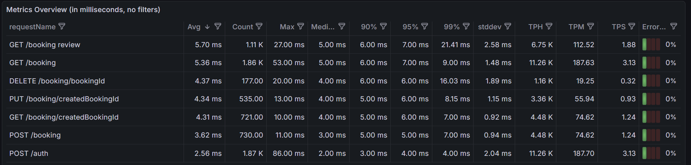
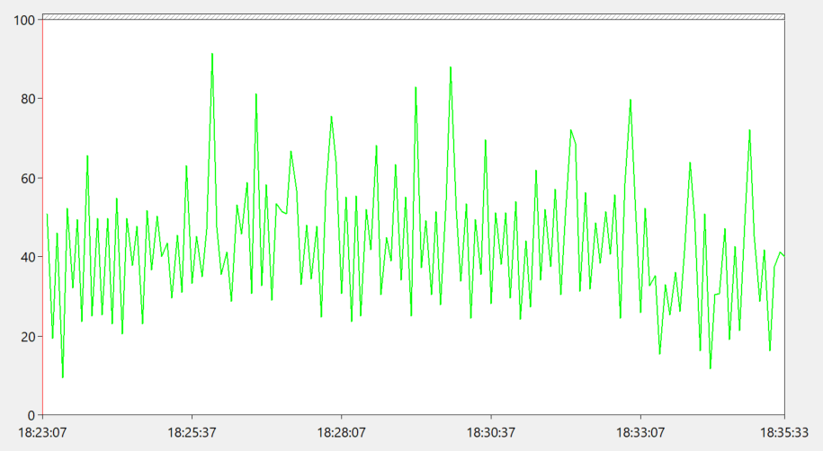
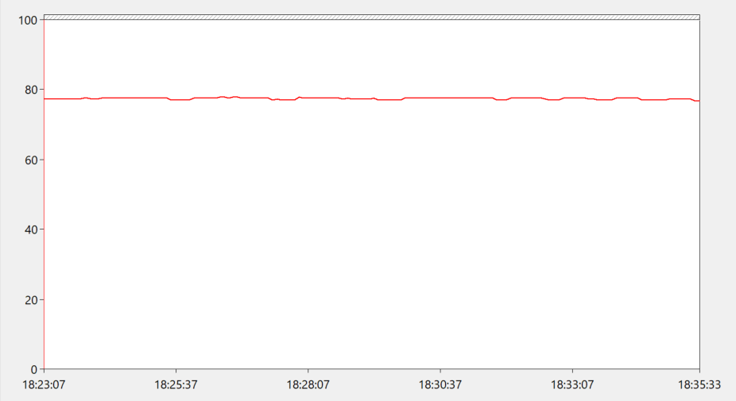

# API Performance Testing — Restful Booker

> Performance testing portfolio project using **Apache JMeter, InfluxDB, Grafana and Windows Performance Monitor**.

---

## 🎯 Objectives

- Evaluate API stability under sustained concurrent load
- Measure response time and throughput
- Analyze **P90 / P95 / P99** latency
- Monitor error rate
- Validate behavior under increasing concurrency
- Identify concurrency and data-consistency issues
- Correlate API performance with system resource utilization

---

## 🛠 Tech Stack

| Tool | Purpose |
|---|---|
| **Apache JMeter 5.6.3** | Load & stress testing |
| **REST API — Restful Booker** | System under test |
| **Groovy / JSR223** | Dynamic correlation & scripting |
| **InfluxDB** | Time-series metrics |
| **Grafana** | Performance dashboards |
| **Windows Performance Monitor** | CPU & memory monitoring |

---

## 🧪 Test Scenario

```text
Thread Group
│
├── Authentication
│
├── Review — 60%
│   ├── GET /booking
│   │   └── JSON Extractor → bookingId
│   └── GET /booking/{bookingId}
│
└── Manage Booking — 40%
    ├── POST /booking
    │   └── JSON Extractor → createdBookingId
    │
    └── Booking operation
        ├── PUT /booking/{createdBookingId} — 75%
        └── DELETE /booking/{createdBookingId} — 25%
```

### Approximate operation distribution

| Operation | Share |
|---|---:|
| GET /booking | **60%** |
| POST /booking | **40%** |
| PUT /booking/{id} | **30%** |
| DELETE /booking/{id} | **10%** |

---

# 📊 Load Test

**Profile:** 50 concurrent users · 10 minutes · Non-GUI execution

| Metric | Result |
|---|---:|
| Users | **50** |
| Duration | **10 min** |
| Total requests | **9,262** |
| Throughput | **~15.4 req/s** |
| Average response time | **3 ms** |
| Minimum | **0 ms** |
| Maximum | **37 ms** |
| Error rate | **0.00%** |

### Concurrent Users



### Throughput



> Steady-state throughput in the Grafana view was approximately **12.5–13.3 req/s**.

### Throughput by Endpoint



---

# ⏱ Response Time

## P90



| Endpoint | P90 |
|---|---:|
| GET /booking review | **6 ms** |
| GET /booking | **6 ms** |
| DELETE /booking/bookingId | **6 ms** |
| PUT /booking/createdBookingId | **5 ms** |
| GET /booking/createdBookingId | **5 ms** |
| POST /booking | **5 ms** |
| POST /auth | **3 ms** |

## P95



| Endpoint | P95 |
|---|---:|
| GET /booking review | **7 ms** |
| GET /booking | **7 ms** |
| DELETE /booking/bookingId | **6 ms** |
| PUT /booking/createdBookingId | **6 ms** |
| GET /booking/createdBookingId | **6 ms** |
| POST /booking | **5 ms** |
| POST /auth | **4 ms** |

## P99



| Endpoint | P99 |
|---|---:|
| GET /booking review | **21.41 ms** |
| GET /booking | **9.00 ms** |
| DELETE /booking/bookingId | **16.03 ms** |
| PUT /booking/createdBookingId | **8.15 ms** |
| GET /booking/createdBookingId | **7.00 ms** |
| POST /booking | **7.00 ms** |
| POST /auth | **4.00 ms** |

---

# 🔥 Stress Test

A separate step-load test was executed with increasing concurrency:

```text
100 → 150 → 200 concurrent users
```

### JMeter results

| Metric | Result |
|---|---:|
| Maximum users | **200** |
| Total requests | **26,023** |
| Average response time | **5 ms** |
| Maximum response time | **38 ms** |
| Errors | **11** |
| Error rate | **0.04%** |

Approximate throughput increased from:

- **~29 req/s** at 100 users
- **~43 req/s** at 150 users
- **~57 req/s** at 200 users

---

# 🖥️ System Resource Monitoring

CPU and memory were measured during the clean Stress Test run using the built-in **Windows Performance Monitor** with a **5-second sampling interval**.

| Resource | Min | Average | Max |
|---|---:|---:|---:|
| **CPU** | **0.95%** | **4.33%** | **9.16%** |
| **Memory (Committed)** | **76.79%** | **77.37%** | **77.80%** |

### CPU



### Memory



### Min / Average / Max


### Interpretation

- CPU utilization remained very low throughout the test.
- **4.33% average CPU / 9.16% maximum** indicates that the JMeter host was **not CPU-bound**.
- Memory utilization remained stable at approximately **77%**.
- No significant resource saturation was observed on the test machine.

> **Memory metric note:** the collected counter is **% Committed Bytes In Use / % использования выделенной памяти**. It represents committed memory utilization and is not a direct percentage of physical RAM usage.

---

# ⚠️ Data Consistency / Race Condition

The booking dataset is dynamic. Under concurrent execution, the following situation is possible:

```text
User A: GET /booking → receives ID 123
User B: DELETE /booking/123
User A: GET /booking/123 → 404
```

This is a **concurrency / data-consistency issue**, not automatically a technical performance failure.

The test does **not** simply hide all `404` responses by marking them successful.

---

# 📈 Monitoring Architecture

```text
                    ┌──────────────┐
                    │ Apache JMeter│
                    └──────┬───────┘
                           │
                           ▼
                    ┌──────────────┐
                    │   InfluxDB   │
                    └──────┬───────┘
                           │
                           ▼
                    ┌──────────────┐
                    │   Grafana    │
                    └──────────────┘

        Windows Performance Monitor
                    │
                    ├── CPU
                    └── Memory
```

### Monitored metrics

- Virtual Users
- Throughput / RPS
- Endpoint throughput
- Average response time
- P90 / P95 / P99
- Error rate
- Endpoint-level performance
- CPU utilization
- Memory utilization

---

# ▶️ Run

```bat
cd C:\Projects\apache-jmeter-5.6.3\bin

jmeter.bat -n -t "C:\Projects\apache-jmeter-5.6.3\Projects\api_load_test\testplan\api_load_test.jmx" -l "C:\Projects\apache-jmeter-5.6.3\Projects\api_load_test\testplan\results.jtl"
```

---

# 📁 Repository Structure

```text
api-performance-testing/
├── README.md
├── jmeter/
│   └── api_load_test.jmx
├── results/
│   ├── load-test/
│   └── stress-test/
└── screenshots/
    ├── 01-concurrent-users.png
    ├── 02-throughput.png
    ├── 03-throughput-by-endpoint.png
    ├── 04-response-time-p90.png
    ├── 05-response-time-p95.png
    ├── 06-metrics-overview.png
    ├── 07-memory-graph.png
    ├── 08-cpu-graph.png
    └── 09-resource-stats.png
```

---

# 🏆 Key Results

### Load Test

**50 users / 10 min → ~15.4 req/s → 3 ms average → 0.00% errors**

### Latency

**P90 ≤ 7 ms · P95 ≤ 7 ms · P99 ≤ 21.41 ms**

### Stress Test

**Up to 200 users → 26,023 requests → 5 ms average → 0.04% errors**

### System Resources

**CPU: 4.33% average / 9.16% max**

**Memory: 77.37% average / 77.80% max**

---

# 👨‍💻 Skills Demonstrated

**Performance Test Planning · Load Testing · Stress Testing · Apache JMeter · REST API Testing · Dynamic Correlation · JSON Extractor · JSR223/Groovy · Throughput Controller · Authentication · InfluxDB · Grafana · Windows Performance Monitor · Percentile Analysis · Concurrency/Race-Condition Analysis · Performance Reporting**
